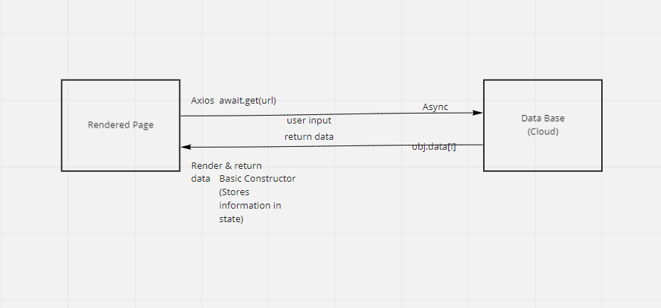
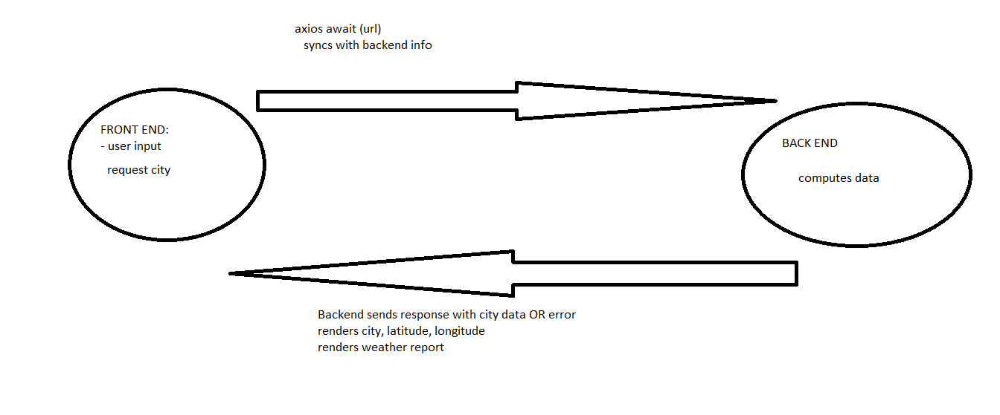
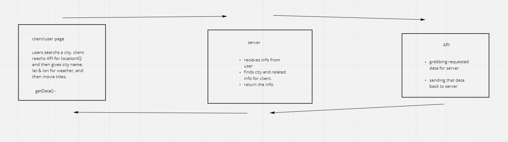

# City Explorer

**Author**: Bryce Pfingston
**Version**: 1.0.0 (increment the patch/fix version number if you make more commits past your first submission)
**URL**: [Bryce's Bestest City Explorer](https://brycesbestestcityexplorer.netlify.app/)

## Overview
It is an application that will take in a city name, and return a map of the longitude and latitude coordinated with that city name. It's useful for any kind of application that requires maps.

## Getting Started
must be able to take in user submitted data inside a form
must be able to use a key and API pairing
must be able to render and return information based on the information provided.

## Architecture
Javascript,
CSS,
BootStrap,
React,
LocationIQ - key/API;

## Change Log
<!-- Use this area to document the iterative changes made to your application as each feature is successfully implemented. Use time stamps. Here's an example:

01-01-2001 4:59pm - Application now has a fully-functional express server, with a GET route for the location resource. -->

Name of feature: Set up your React repository & API keys.  

Estimate of time needed to complete: 30 min  

Start time: 3:30 pm  

Finish time: 4:00 pm  

Actual time needed to complete: 30 min  
  

Name of feature: Locations: As a user of City Explorer, I want to enter the name of a location so that I can see the exact latitude and longitude of that location.  

Estimate of time needed to complete: 1 hour  
  
Start time: 4:00 pm  
  
Finish time: 6:00 pm  
  
Actual time needed to complete: 2 hours  
  

Name of feature: Map: As a user, I want to see a map of the city so that I can see the layout of the area I want to explore.  

Estimate of time needed to complete: 1 hours  
  
Start time: 7:00 pm  
  
Finish time: 8:00 pm  
  
Actual time needed to complete: 1 hour  
  
  
Name of feature: Errors: As a user, I want clear messages if something goes wrong so I know if I need to make any changes or try again in a different manner.  

Estimate of time needed to complete: 30 min  
  
Start time: 8:00 pm  
  
Finish time: 8:30 pm  
  
Actual time needed to complete: 30 min  

Name of feature: Weather (placeholder)

Estimate of time needed to complete: 2 hours

Start time: 2:30 pm

Finish time: 7:00 pm

Actual time needed to complete: 4.5 hours

Name of feature: Errors (revisited)

Estimate of time needed to complete: 4 hours

Start time: 8 pm

Finish time: 12pm

Actual time needed to complete: 4 hours

Name of feature: Publish: Deploy your server.

Estimate of time needed to complete: 15 minutes

Start time: 12:00

Finish time: 12:30

Actual time needed to complete: 30 min

## Credit and Collaborations
<!-- Give credit (and a link) to other people or resources that helped you build this application. -->

